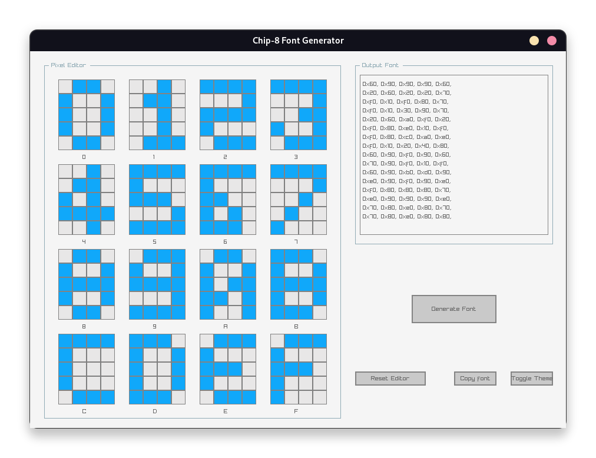

# c8fontgen

c8fontgen - abbreviated from Chip-8 Font Generator, is a tiny pixel editor
that allows you to generate custom chip-8 fonts. Chip-8 Sprites are 4x5, 1-bit
coded, and formatted as a simple array of bytes.

## Feature Set

- 16 Pixel Editors for each sprite.
- Outputs in various numerical bases. (WIP)
- All written in pure C code.
- Dark/Light Themes. (WIP)

## Dependencies

- raygui
- raylib
- gcc
- cmake

## Goals

- Support font generation for other Chip-8 Variants.
- More themes
- Bidirectional font editing ( Pixels <-> Bytes )
