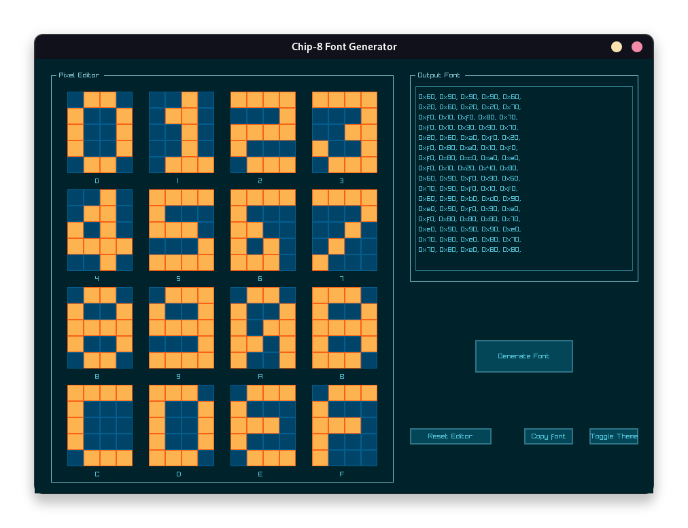

# c8fontgen

c8fontgen - abbreviated from Chip-8 Font Generator, is a tiny pixel editor
that allows you to generate custom chip-8 fonts. Chip-8 Sprites are 4x5, 1-bit
coded, and formatted as a simple array of bytes.
Chip-8 only uses the first or higher nibble to encode the fonts. You will notice
that the numerical output has it's lower nibble set to zero, always. 

## Feature Set

- 16 Pixel Editors for each sprite.
- Completely written in pure C.
- Dark/Light Themes.

## Dependencies

- raygui
- raylib
- cmake (build)

## Theme Showcase

Both of the following themes are adaptations from the default (light) and
cyber theme that can be found in [rGuiStyler](https://raylibtech.itch.io/rguistyler).
The adaptations only change toggle theme colors.

- LightC8

- CyberC8

## Goals

- Support font generation for other Chip-8 Variants.
- More themes
- Bidirectional font editing ( Pixels <-> Bytes )
